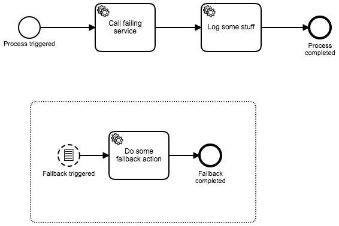

# Functional fallback for a technical retry

## Proposed solution

* Service Task with asynchronous before and custom retry time cycle
  * if all retries failed -> camunda creates an incident automatically
* implement a custom incident handler, that triggers the fallback sub process
  * in this example done via a conditional start event based on the creation of a process variable
  * could also be done using a message start event
  * as the start event of the sub process is non-interrupting a process token stays in the original service task and 
  can be retried via Cockpit or API later

## Leftovers

* The custom incident handler currently handles all incidents - there is no distinction between different kinds of 
incidents.
* The functional fallback could be used for any service task.
    * Use an expanded sub process for "Call failing service" task, so that the fallback is only available as long as 
    the expanded sub process is active.
* Use circuit breaker in synchronous communication! Always!
  * Why not Hystrix fallback feature?
    * not visible in process diagramm
    * hides current processing state in Cockpit
    * no auditing whether fallback was executed or not

## Stack
 
* Camunda BPM
* Spring Boot