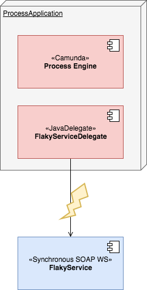

# Functional fallback for a technical retry

## Mission

* From your process, call a synchronous WebService that is quite "unstable".
* As your customer is waiting for your processing result, purely waiting for the service to come up again is no option.
* In case the service is unavailable, it is acceptable to retry the call two times within ten seconds.
* There is a functional fallback, f.e. generata a pdf and sent it to the customer via mail, that should be triggered 
if all automatic retries failed.
* The functional fallback should be executed exactly once.
* The functional fallback should be visible in the process diagramm.
* The actual service call should be caught up as soon as the service becomes available again without retriggering the
 fallback once more (s. above).

## Proposed solution

* Service Task with asynchronous before and custom retry time cycle
  * if all retries failed -> camunda creates an incident automatically
* implement a custom incident handler, that triggers the fallback sub process
  * in this example done via a conditional start event based on the creation of a process variable
  * could also be done using a message start event
  * as the start event of the sub process is non-interrupting a process token stays in the original service task and 
  can be retried via Cockpit or API later

## Leftovers

* The custom incident handler currently handles all incidents - there is no distinction between different kinds of 
incidents.
* The functional fallback could be used for any service task.
    * Use an expanded sub process for "Call failing service" task, so that the fallback is only available as long as 
    the expanded sub process is active.
* Use circuit breaker in synchronous communication! Always!
  * Why not Hystrix fallback feature?
    * not visible in process diagramm
    * hides current processing state in Cockpit
    * no auditing whether fallback was executed or not

## Stack
 
* Camunda BPM
* Spring Boot